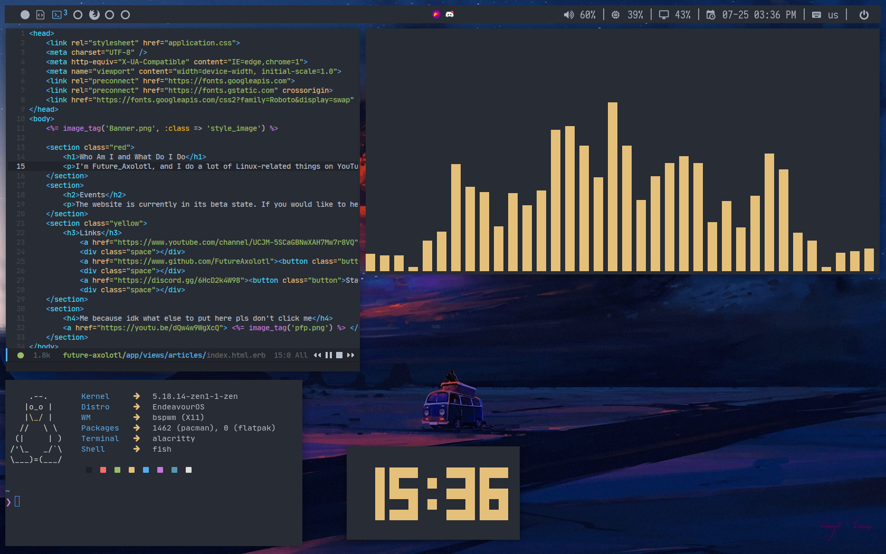

# one-dark-dotfiles
A collection of dotfiles made with the One Dark colorscheme
Thanks to [CordlessCoder](https://github.com/CordlessCoder) for the [polywins Polybar module](https://github.com/CordlessCoder/polywins.py)!

NOTE: Dotfiles may consistently update.



# Dependencies
You will at least need to have:

* Iosevka Nerd Font
* JetBrainsMono Nerd Font
* Fish Shell and [Oh my Fish](https://github.com/oh-my-fish/oh-my-fish) with the [Fish Pure Theme](https://github.com/pure-fish/pure) installed
* Dunst
* Picom
* BSPWM & SXHKD
* Alacritty
* Emacs with [Doom Emacs](https://github.com/doomemacs/doomemacs) installed
* Treemacs Emacs package installed for a sidebar that shows files
* Tremacs-All-The-Icons Emacs package installed for the icons in Treemacs
* Vterm Emacs package installed for an Emacs terminal emulator (optional)
* Polybar
* Macchina
* Feh
* Rofi
* Discord with [BetterDiscord](https://github.com/BetterDiscord/BetterDiscord) installed

NOTE: you may have to edit the `sxhkdrc` file based off of what you use for a web browser

# Installation

``` sh
git clone https://github.com/FutureAxolotl/one-dark-dotfiles.git && cd one-dark-dotfiles && chmod +x install.sh && ./install.sh
```

